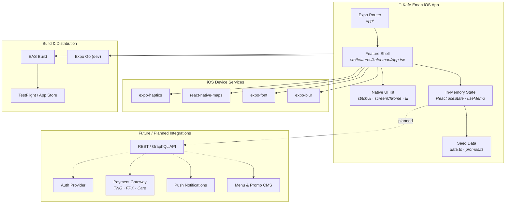
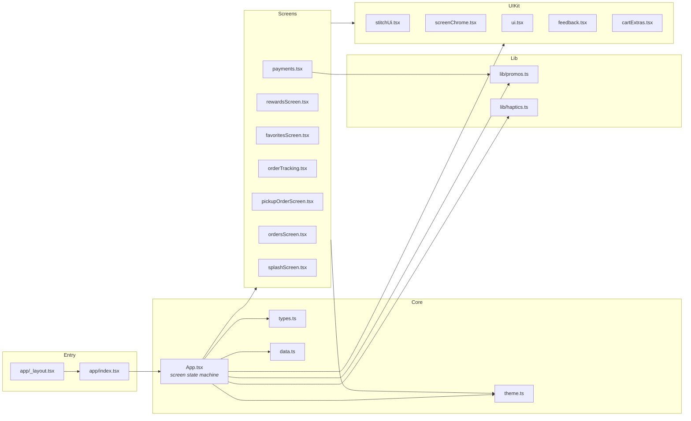
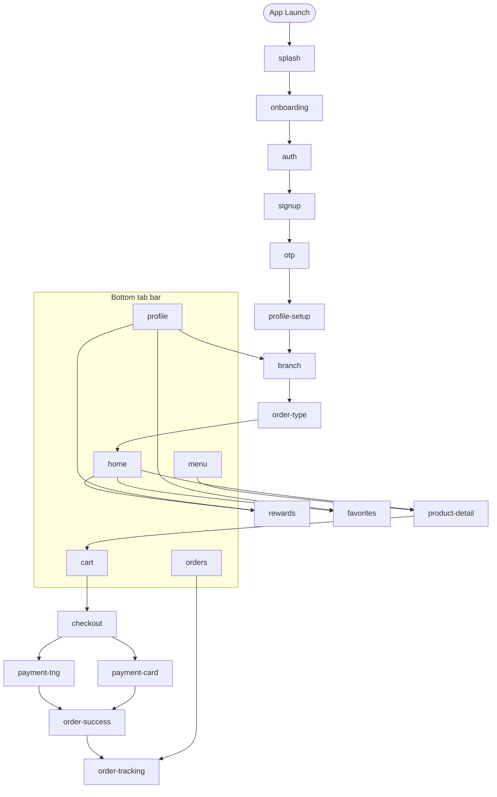
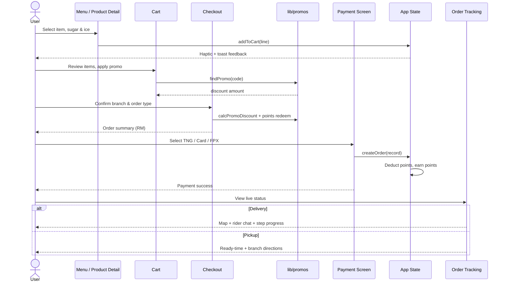
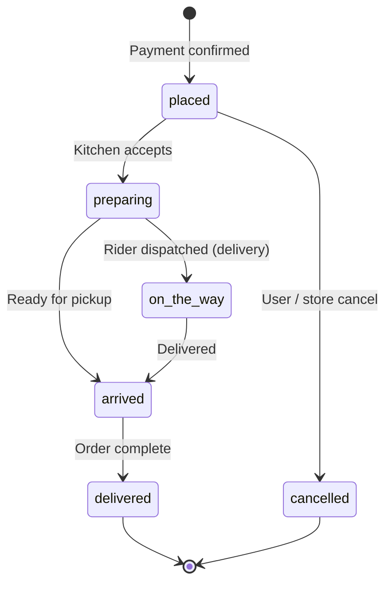
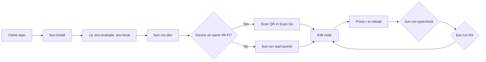
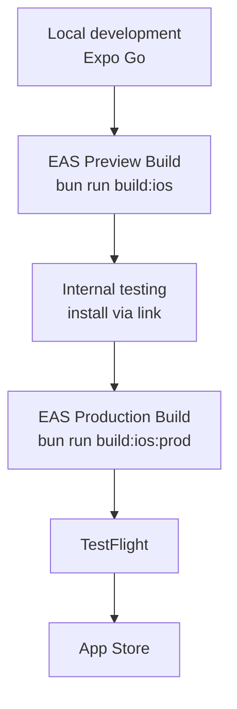

# Kafe Eman

Native **iOS** coffee ordering app for **Kafe Eman** (Malaysia). Built with Expo SDK 54, React Native, and TypeScript — a real native app (not a WebView), styled with the **Artisanal Sage** design system.

[](https://expo.dev)
[](https://reactnative.dev)
[](https://www.typescriptlang.org)
[](https://bun.sh)
[](https://developer.apple.com/ios/)
[](LICENSE)

**Repository:** [github.com/mawlid1431/Kafe_app](https://github.com/mawlid1431/Kafe_app)

---

## Table of contents

- [Overview](#overview)
- [Features](#features)
- [System architecture](#system-architecture)
- [Application architecture](#application-architecture)
- [Navigation & screen flow](#navigation--screen-flow)
- [Order workflow](#order-workflow)
- [State & data layer](#state--data-layer)
- [Tech stack](#tech-stack)
- [Project structure](#project-structure)
- [Getting started](#getting-started)
- [Admin dashboard (web)](#admin-dashboard-web)
- [Development workflow](#development-workflow)
- [Build & deployment](#build--deployment)
- [Design system](#design-system)
- [Demo promo codes](#demo-promo-codes)
- [Documentation](#documentation)
- [Author](#author)
- [License](#license)

---

## Overview

Kafe Eman is a premium mobile ordering experience for a Malaysian specialty coffee brand. The app covers the full customer journey — onboarding, menu browsing, cart and checkout, live order tracking, loyalty rewards, and profile management — with tactile haptics, sage-toned glass UI surfaces, and polished empty states.

| Attribute | Detail |
|-----------|--------|
| **Platform** | iOS only (iPhone & iPad) |
| **Runtime** | Expo 54 · React Native 0.81 · React 19 |
| **Package manager** | Bun (required) |
| **Distribution** | Expo Go (dev) · EAS Build (TestFlight / App Store) |
| **Data** | Convex backend + client seed data (demo / MVP) |
| **Admin** | Separate web dashboard at `http://localhost:5173` |

---

## Features

- **Onboarding & auth** — splash, onboarding slides, sign up / login, OTP, profile setup, branch picker
- **Home** — time-based greeting, store bar (branch + delivery/pickup), search, promo banners, offers, rewards teaser, order again
- **Menu & product detail** — categories, favourites, sugar/ice customization, add to cart with haptics + toasts
- **Cart & checkout** — promo codes, variant-safe quantities, order summary, points redemption, TNG / card / FPX payment flows
- **Orders** — active & past tabs, live tracking map (delivery), pickup status screen, reorder
- **Rewards** — points balance, tiers, redeem rewards, history
- **Favourites** — save drinks and reorder quickly
- **Profile** — loyalty card, settings, help, logout
- **Sage glass UI** — `expo-blur` glass surfaces, polished empty states, image loading skeletons

---

## System architecture

High-level view of how the mobile app fits into the broader ecosystem. The current build is a **client-only MVP** with seeded data; backend services are planned integration points.



### Architecture layers

| Layer | Responsibility | Key modules |
|-------|----------------|-------------|
| **Shell** | Font loading, safe areas, gesture root, Expo Router entry | `app/_layout.tsx`, `app/index.tsx` |
| **Feature** | Screen routing, business logic, cart/orders/rewards state | `src/features/kafeeman/App.tsx` |
| **Presentation** | Reusable screens and glass UI components | `native/*.tsx` |
| **Domain** | Types, promo rules, haptics helpers | `types.ts`, `lib/promos.ts`, `lib/haptics.ts` |
| **Data** | Menu, branches, seed orders, rewards catalog | `data.ts` |
| **Theme** | Brand tokens, typography, shadows | `theme.ts`, `native/fonts.ts` |

---

## Application architecture

Internal module dependency graph inside the feature package.



---

## Navigation & screen flow

The app uses a **single-root state machine** (`screen` state in `App.tsx`) rather than nested Expo Router screens. Tab navigation maps five bottom tabs to primary screens.



### Screen inventory

| Screen | Purpose |
|--------|---------|
| `splash` | Brand splash with animated handoff |
| `onboarding` | Feature slides for first-time users |
| `auth` / `signup` / `otp` / `profile-setup` | Account creation flow |
| `branch` / `order-type` | Store & fulfilment selection |
| `home` | Dashboard, promos, quick reorder |
| `menu` / `product-detail` | Browse & customize drinks |
| `cart` / `checkout` | Review, promos, points |
| `payment-tng` / `payment-card` | Simulated payment UIs |
| `order-success` / `order-tracking` | Confirmation & live map |
| `orders` | Active & past order history |
| `rewards` / `favorites` / `profile` | Loyalty & account |

---

## Order workflow

End-to-end flow from menu selection to order completion.



### Order lifecycle states



---

## State & data layer

### Client state (current)

All runtime state lives in `App.tsx` via React hooks:

| State | Type | Description |
|-------|------|-------------|
| `screen` | `Screen` | Active view in the state machine |
| `tab` | `TabKey` | Bottom navigation selection |
| `cart` | `CartLine[]` | Items with sugar/ice variants |
| `orders` | `OrderRecord[]` | Active & historical orders |
| `favorites` | `number[]` | Favourited menu item IDs |
| `points` | `number` | Loyalty balance |
| `appliedPromo` | `PromoCode \| null` | Active checkout discount |
| `orderType` | `delivery \| pickup` | Fulfilment mode |
| `selectedBranch` | `string` | Current store location |

### Seed data (`data.ts`)

| Dataset | Contents |
|---------|----------|
| `MENU` | 10 drinks & food items with images, ratings, badges |
| `BRANCHES` | Malaysian store locations |
| `PROMOS` | Home banner promotions |
| `REWARD_TIERS` | Bronze / Silver / Gold thresholds |
| `REWARD_CATALOG` | Redeemable loyalty items |
| `createSeedOrders()` | Demo active & past orders |

### Promo engine (`lib/promos.ts`)

Validates promo codes, enforces minimum spend, calculates percentage/fixed discounts, and handles points-to-RM conversion at checkout.

---

## Tech stack

| Layer | Technology |
|-------|------------|
| **Platform** | iOS only |
| **Framework** | Expo 54 + Expo Router 6 |
| **UI** | React Native (native components) |
| **Animation** | react-native-reanimated 4 |
| **Maps** | react-native-maps |
| **Glass effects** | expo-blur + custom `GlassSurface` |
| **Typography** | Plus Jakarta Sans (`expo-font`) |
| **Haptics** | expo-haptics |
| **Design** | Artisanal Sage (`design.md`) |
| **Language** | TypeScript (strict) |
| **Package manager** | Bun |
| **Builds** | EAS (`eas.json`) |

---

## Project structure

```
mobile/
├── Admin/                        # Web admin dashboard (Vite + React)
│   └── src/admin/                # Login, sidebar, management pages
├── convex/                       # Convex backend (orders, menu, admins)
├── app/                          # Expo Router shell
│   ├── _layout.tsx               # Fonts, splash, providers
│   ├── index.tsx                 # → KafeemanApp entry
│   └── +not-found.tsx
├── src/features/kafeeman/
│   ├── App.tsx                   # Main app — screens & state machine
│   ├── data.ts                   # Menu, branches, promos, seed orders
│   ├── theme.ts                  # Brand colors, spacing, typography
│   ├── brand.ts                  # Logo assets & brand identity
│   ├── types.ts                  # Screen, Order, Cart types
│   ├── lib/
│   │   ├── promos.ts             # Promo validation & discounts
│   │   └── haptics.ts            # Tactile feedback helpers
│   └── native/
│       ├── stitchUi.tsx          # Sage glass UI kit
│       ├── screenChrome.tsx      # Headers, store bar, empty states
│       ├── ui.tsx                # Images, buttons, primitives
│       ├── feedback.tsx          # Toast notifications
│       ├── payments.tsx          # Checkout & payment screens
│       ├── ordersScreen.tsx      # Order history
│       ├── orderTracking.tsx     # Live delivery map
│       ├── pickupOrderScreen.tsx # Pickup status
│       ├── rewardsScreen.tsx     # Points & rewards
│       ├── favoritesScreen.tsx   # Saved drinks
│       ├── cartExtras.tsx        # Notes & points redeem
│       └── splashScreen.tsx      # Animated splash
├── assets/
│   ├── brand/                    # Logo & icon (from logos/)
│   └── images/                   # App icon & splash
├── logos/                        # Original brand logo assets
├── docs/                         # Installation & guidelines
├── design.md                     # Artisanal Sage design tokens
├── app.json                      # Expo config
├── eas.json                      # EAS build profiles
└── package.json
```

---

## Getting started

### Prerequisites

| Tool | Version | Notes |
|------|---------|-------|
| [Bun](https://bun.sh) | ≥ 1.1 | Required package manager |
| Node.js | 18+ | Used by Expo tooling |
| iPhone + [Expo Go](https://expo.dev/go) | SDK 54 | Dev preview on device |
| Mac (optional) | — | iOS Simulator + App Store builds |

### Install & run

```bash
bun install
cp .env.example .env.local   # optional — see Environment
bun run dev
```

Scan the QR code with **Expo Go** on your iPhone (same Wi‑Fi as your dev machine).

If LAN does not work (e.g. Windows → iPhone):

```bash
bun run start:tunnel
```

Press **`r`** in the terminal to reload after code changes.

### Environment

Create `.env.local` (not committed to git):

```env
EAS_PROJECT_ID=your-eas-project-id
EXPO_USE_BUN=1
```

Get `EAS_PROJECT_ID` from [expo.dev](https://expo.dev) after linking the project, or copy from `app.json` → `extra.eas.projectId`.

For Convex + Clerk, also set `EXPO_PUBLIC_CONVEX_URL`, `EXPO_PUBLIC_CLERK_PUBLISHABLE_KEY`, and `CONVEX_DEPLOYMENT` (see `.env.example`).

---

## Admin dashboard (web)

The **`Admin/`** folder is a **separate Vite + React web app** — not part of the mobile Expo app. Use it to manage branches, menu, orders, promos, customers, staff, and notifications.

| Item | Detail |
|------|--------|
| **URL** | [http://localhost:5173/login](http://localhost:5173/login) |
| **Stack** | Vite · React 19 · Tailwind · Convex |
| **Login** | `admin` / `admin123` (after seed) |

### First-time setup

```bash
bun install
cd Admin && bun install && cd ..

# Terminal 1 — Convex backend
bun run convex:dev

# Terminal 2 — seed demo data + default admin user
bun run convex:seed

# Terminal 3 — mobile + admin together
bun run dev
```

Or run only the admin panel:

```bash
bun run admin
```

Or mobile app only:

```bash
bun run app
```

### Admin sidebar

Dashboard · Branches · Menu · Orders (processing / track / history) · Promos · Rewards · Users · Notifications · Staff · Account

---

## Development workflow



### Scripts

| Command | Description |
|---------|-------------|
| `bun run dev` | Start Expo (mobile QR) + Admin together |
| `bun run app` | Expo mobile app only |
| `bun run admin` | Admin web dashboard only |
| `bun run admin:build` | Production build of Admin |
| `bun run convex:dev` | Convex backend dev server |
| `bun run convex:seed` | Seed branches, menu, promos, orders, admin user |
| `bun run dev:clear` | Start app with cleared Metro cache |
| `bun run start:tunnel` | Start with tunnel (remote device testing) |
| `bun run ios` | Run on iOS simulator (macOS only) |
| `bun run typecheck` | TypeScript check |
| `bun run lint` | ESLint |
| `bun run build:ios` | EAS preview build |
| `bun run build:ios:prod` | EAS production build |

> This project uses **Bun only** — not npm. Install deps with `bun install`.

### Code conventions

- **Feature-first** — all app logic lives under `src/features/kafeeman/`
- **Typed screens** — navigation uses the `Screen` union in `types.ts`
- **Theme tokens** — use `useBrandTheme()` / `BRAND` constants, not hard-coded hex values
- **Haptics on actions** — cart add, promo apply, payment success via `lib/haptics.ts`
- **Bun only** — `preinstall` blocks npm, yarn, and pnpm

---

## Build & deployment



```bash
bunx eas-cli login
bun run build:ios          # internal preview
bun run build:ios:prod     # production → TestFlight / App Store
```

| Profile | Distribution | Use case |
|---------|--------------|----------|
| `development` | Internal (simulator) | Dev client builds |
| `preview` | Internal (device) | QA & stakeholder review |
| `production` | App Store | TestFlight & release |

See [docs/INSTALLATION.md](docs/INSTALLATION.md) for full setup instructions.

---

## Design system

The app follows the **Artisanal Sage** aesthetic — forest green accents, parchment surfaces, and soft sage glass navigation. Tokens live in `design.md` and are implemented in `src/features/kafeeman/theme.ts`.

| Token | Value | Usage |
|-------|-------|-------|
| Primary | `#355927` | Buttons, key actions |
| Accent | `#a8d293` | Highlights, rewards |
| Surface | `#f9faf2` | Backgrounds |
| Parchment | `#e9e1d6` | Cards, inputs |
| Glass | `rgba(249,250,242,0.70)` | Nav bar, overlays |

**References:**

- Design tokens & brand guidelines: [`design.md`](design.md)
- Logo assets: [`logos/`](logos/) · bundled in [`assets/brand/`](assets/brand/)

**Typography:** Plus Jakarta Sans (display, UI, labels, body)

---

## Demo promo codes

| Code | Effect |
|------|--------|
| `WELCOME10` | 10% off |
| `KEAMAN15` | 15% off (min spend) |
| `FREESHIP` | Free delivery |
| `BOGO50` | BOGO 50% off |

---

## Documentation

| Document | Description |
|----------|-------------|
| [docs/INSTALLATION.md](docs/INSTALLATION.md) | Full iOS setup, EAS builds, troubleshooting |
| [docs/guidelines/Guidelines.md](docs/guidelines/Guidelines.md) | Contribution & coding guidelines |
| [docs/ATTRIBUTIONS.md](docs/ATTRIBUTIONS.md) | Third-party assets & licenses |

---

## Author

**Mawlid Mohamud (Malitos)** — Software Engineer & AI Innovator

End-to-end developer specializing in modern design, system architecture, and AI integration. ALX Software Engineering graduate, currently pursuing a Bachelor of Computer Science in Malaysia. Builder of 30+ live production projects including **CallBack AI** and **Pure CRM**.

| | |
|---|---|
| **GitHub** | [github.com/mawlid1431](https://github.com/mawlid1431) |
| **Portfolio** | [devmowlid.vercel.app](https://devmowlid.vercel.app/) |
| **Email** | [malitmohamud@gmail.com](mailto:malitmohamud@gmail.com) |
| **X (Twitter)** | [@malitfx](https://x.com/malitfx) |
| **Freelancer** | [Malithaibe](https://www.freelancer.com/u/Malithaibe) |
| **Upwork** | [Profile](https://www.upwork.com/freelancers/~0170d3d730409d6252) |
| **Organization** | [buildSOM](https://github.com/buildSOM) |

> *"BUILD A STORY FOR EVERYDAY"*

---

## License

This project is licensed under the **MIT License** — see [LICENSE](LICENSE) for the full text.

Copyright © 2026 [Mawlid Mohamud (Malitos)](https://github.com/mawlid1431)
