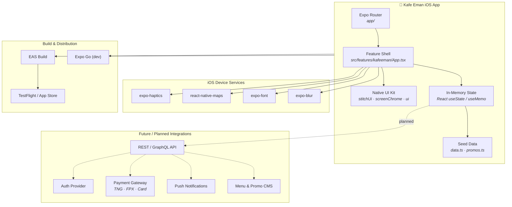
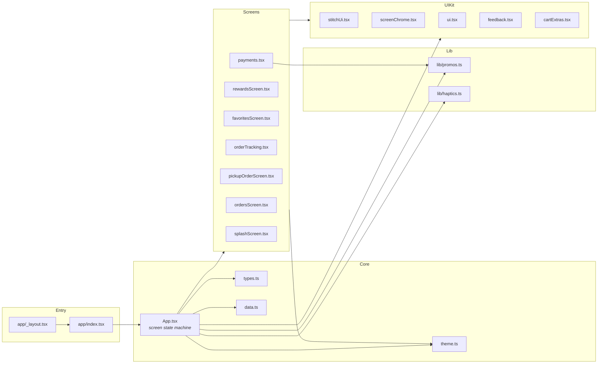
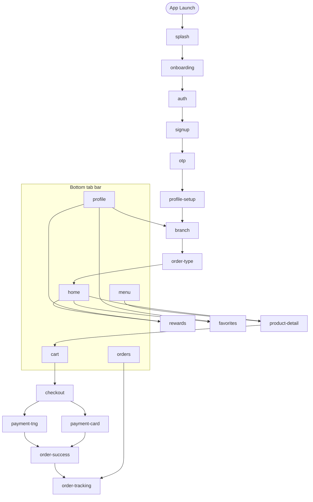
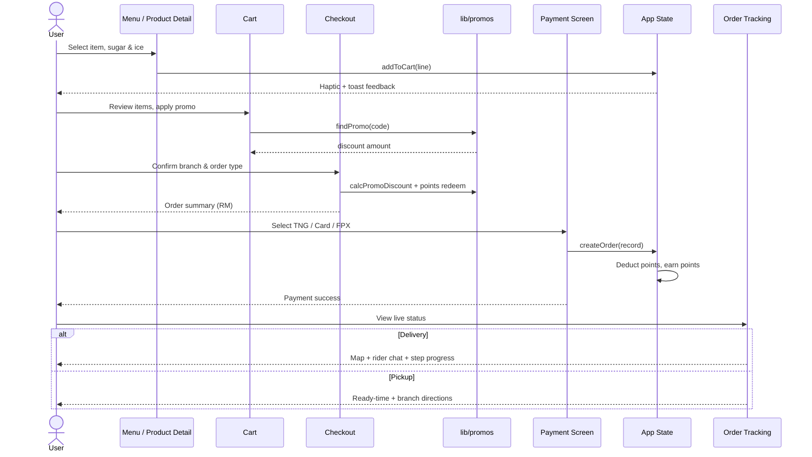
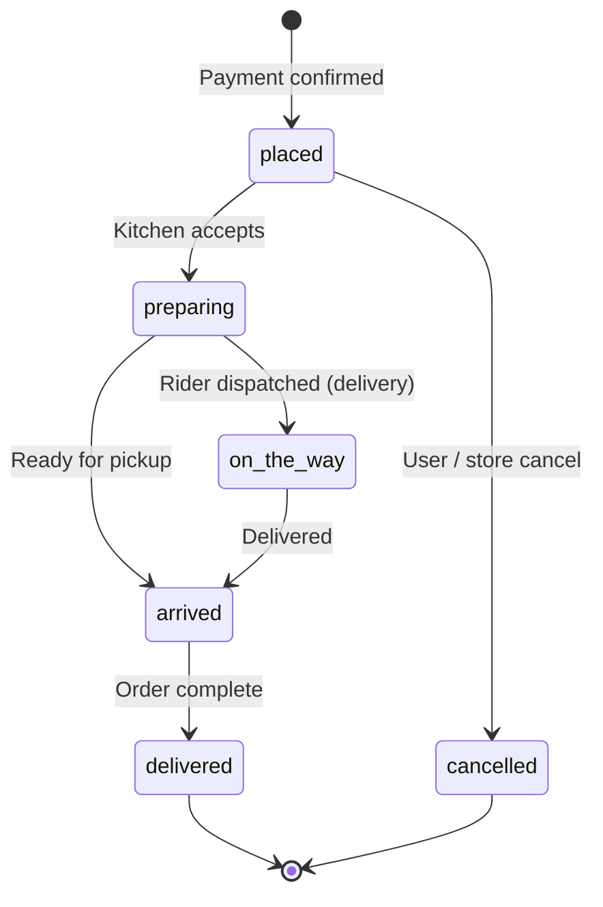
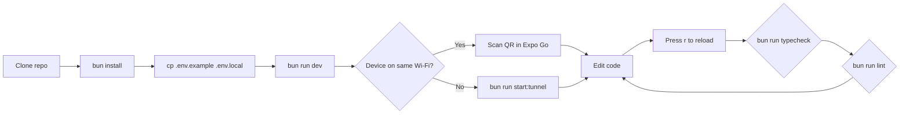
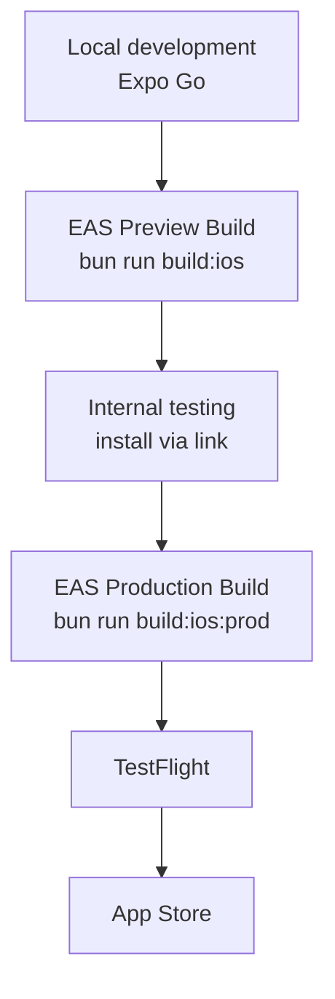

# Kafe Eman

Native **iOS** coffee ordering app for **Kafe Eman** (Malaysia). Built with Expo SDK 54, React Native, and TypeScript — a real native app (not a WebView), styled with the **Artisanal Sage** design system.

[](https://expo.dev)
[](https://reactnative.dev)
[](https://www.typescriptlang.org)
[](https://bun.sh)
[](https://developer.apple.com/ios/)
[](LICENSE)

**Repository:** [github.com/mawlid1431/Kafe_app](https://github.com/mawlid1431/Kafe_app)

---

## Table of contents

- [Overview](#overview)
- [Features](#features)
- [System architecture](#system-architecture)
- [Application architecture](#application-architecture)
- [Navigation & screen flow](#navigation--screen-flow)
- [Order workflow](#order-workflow)
- [State & data layer](#state--data-layer)
- [Tech stack](#tech-stack)
- [Project structure](#project-structure)
- [Getting started](#getting-started)
- [Landing page (web)](#landing-page-web)
- [Branding, titles & loading states](#branding-titles--loading-states)
- [Admin dashboard (web)](#admin-dashboard-web)
- [Development workflow](#development-workflow)
- [Build & deployment](#build--deployment)
- [Design system](#design-system)
- [Demo promo codes](#demo-promo-codes)
- [Documentation](#documentation)
- [Author](#author)
- [License](#license)

---

## Overview

Kafe Eman is a premium mobile ordering experience for a Malaysian specialty coffee brand. The app covers the full customer journey — onboarding, menu browsing, cart and checkout, live order tracking, loyalty rewards, and profile management — with tactile haptics, sage-toned glass UI surfaces, and polished empty states.

| Attribute | Detail |
|-----------|--------|
| **Platform** | iOS only (iPhone & iPad) |
| **Runtime** | Expo 54 · React Native 0.81 · React 19 |
| **Package manager** | Bun (required) |
| **Distribution** | Expo Go (dev) · EAS Build (TestFlight / App Store) |
| **Data** | NestJS API - Prisma - Neon PostgreSQL - Cloudinary (images) |
| **Web** | Public landing page at `http://localhost:5173` · admin dashboard at `http://localhost:5173/admin` |

---

## Features

- **Onboarding & auth** — splash, onboarding slides, sign up / login, OTP, profile setup, branch picker
- **Home** — time-based greeting, store bar (branch + delivery/pickup), search, promo banners, offers, rewards teaser, order again
- **Menu & product detail** — categories, favourites, sugar/ice customization, add to cart with haptics + toasts
- **Cart & checkout** — promo codes, variant-safe quantities, order summary, points redemption, TNG / card / FPX payment flows
- **Orders** — active & past tabs, live tracking map (delivery), pickup status screen, reorder
- **Rewards** — points balance, tiers, redeem rewards, history
- **Favourites** — save drinks and reorder quickly
- **Profile** — loyalty card, settings, help, logout
- **Sage glass UI** — `expo-blur` glass surfaces, polished empty states, image loading skeletons

---

## System architecture

High-level view of how the mobile app fits into the broader ecosystem. The current build is a **client-only MVP** with seeded data; backend services are planned integration points.


```mermaid
flowchart TB
    subgraph Client["📱 Kafe Eman iOS App"]
        direction TB
        ER["Expo Router<br/><i>app/</i>"]
        APP["Feature Shell<br/><i>src/features/kafeeman/App.tsx</i>"]
        UI["Native UI Kit<br/><i>stitchUi · screenChrome · ui</i>"]
        STATE["In-Memory State<br/><i>React useState / useMemo</i>"]
        SEED["Seed Data<br/><i>data.ts · promos.ts</i>"]
        ER --> APP
        APP --> UI
        APP --> STATE
        STATE --> SEED
    end

    subgraph Device["iOS Device Services"]
        HAPTICS["expo-haptics"]
        MAPS["react-native-maps"]
        FONTS["expo-font"]
        BLUR["expo-blur"]
    end

    subgraph Future["Future / Planned Integrations"]
        API["REST / GraphQL API"]
        AUTH["Auth Provider"]
        PAY["Payment Gateway<br/><i>TNG · FPX · Card</i>"]
        PUSH["Push Notifications"]
        CMS["Menu & Promo CMS"]
    end

    APP --> HAPTICS
    APP --> MAPS
    APP --> FONTS
    APP --> BLUR

    STATE -.->|"planned"| API
    API -.-> AUTH
    API -.-> PAY
    API -.-> PUSH
    API -.-> CMS

    subgraph Build["Build & Distribution"]
        EAS["EAS Build"]
        TF["TestFlight / App Store"]
        EXPO_GO["Expo Go (dev)"]
    end

    Client --> EXPO_GO
    Client --> EAS
    EAS --> TF
```

### Architecture layers

| Layer | Responsibility | Key modules |
|-------|----------------|-------------|
| **Shell** | Font loading, safe areas, gesture root, Expo Router entry | `app/_layout.tsx`, `app/index.tsx` |
| **Feature** | Screen routing, business logic, cart/orders/rewards state | `src/features/kafeeman/App.tsx` |
| **Presentation** | Reusable screens and glass UI components | `native/*.tsx` |
| **Domain** | Types, promo rules, haptics helpers | `types.ts`, `lib/promos.ts`, `lib/haptics.ts` |
| **Data** | Menu, branches, seed orders, rewards catalog | `data.ts` |
| **Theme** | Brand tokens, typography, shadows | `theme.ts`, `native/fonts.ts` |

---

## Application architecture

Internal module dependency graph inside the feature package.


```mermaid
flowchart LR
    subgraph Entry
        IDX["app/index.tsx"]
        LAYOUT["app/_layout.tsx"]
    end

    subgraph Core
        APP["App.tsx<br/><i>screen state machine</i>"]
        TYPES["types.ts"]
        DATA["data.ts"]
        THEME["theme.ts"]
    end

    subgraph Lib
        PROMOS["lib/promos.ts"]
        HAPTICS["lib/haptics.ts"]
    end

    subgraph Screens
        ORDERS["ordersScreen.tsx"]
        REWARDS["rewardsScreen.tsx"]
        FAVS["favoritesScreen.tsx"]
        TRACK["orderTracking.tsx"]
        PICKUP["pickupOrderScreen.tsx"]
        PAY["payments.tsx"]
        SPLASH["splashScreen.tsx"]
    end

    subgraph UIKit
        STITCH["stitchUi.tsx"]
        CHROME["screenChrome.tsx"]
        UI["ui.tsx"]
        FEEDBACK["feedback.tsx"]
        EXTRAS["cartExtras.tsx"]
    end

    LAYOUT --> IDX
    IDX --> APP
    APP --> TYPES
    APP --> DATA
    APP --> THEME
    APP --> PROMOS
    APP --> HAPTICS
    APP --> Screens
    APP --> UIKit
    Screens --> UIKit
    Screens --> THEME
    PAY --> PROMOS
```

---

## Navigation & screen flow

The app uses a **single-root state machine** (`screen` state in `App.tsx`) rather than nested Expo Router screens. Tab navigation maps five bottom tabs to primary screens.


```mermaid
flowchart TD
    START([App Launch]) --> SPLASH[splash]
    SPLASH --> ONBOARD[onboarding]
    ONBOARD --> AUTH[auth]
    AUTH --> SIGNUP[signup]
    SIGNUP --> OTP[otp]
    OTP --> PROFILE[profile-setup]
    PROFILE --> BRANCH[branch]
    BRANCH --> ORDERTYPE[order-type]
    ORDERTYPE --> HOME[home]

    subgraph Tabs["Bottom tab bar"]
        HOME
        MENU[menu]
        CART[cart]
        ORDERS[orders]
        PROFILE_TAB[profile]
    end

    MENU --> DETAIL[product-detail]
    DETAIL --> CART
    HOME --> DETAIL
    CART --> CHECKOUT[checkout]
    CHECKOUT --> PAY_TNG[payment-tng]
    CHECKOUT --> PAY_CARD[payment-card]
    PAY_TNG --> SUCCESS[order-success]
    PAY_CARD --> SUCCESS
    SUCCESS --> TRACKING[order-tracking]
    ORDERS --> TRACKING

    HOME --> REWARDS[rewards]
    HOME --> FAVS[favorites]
    PROFILE_TAB --> BRANCH
    PROFILE_TAB --> REWARDS
    PROFILE_TAB --> FAVS
```

### Screen inventory

| Screen | Purpose |
|--------|---------|
| `splash` | Brand splash with animated handoff |
| `onboarding` | Feature slides for first-time users |
| `auth` / `signup` / `otp` / `profile-setup` | Account creation flow |
| `branch` / `order-type` | Store & fulfilment selection |
| `home` | Dashboard, promos, quick reorder |
| `menu` / `product-detail` | Browse & customize drinks |
| `cart` / `checkout` | Review, promos, points |
| `payment-tng` / `payment-card` | Simulated payment UIs |
| `order-success` / `order-tracking` | Confirmation & live map |
| `orders` | Active & past order history |
| `rewards` / `favorites` / `profile` | Loyalty & account |

---

## Order workflow

End-to-end flow from menu selection to order completion.


```mermaid
sequenceDiagram
    actor User
    participant Menu as Menu / Product Detail
    participant Cart as Cart
    participant Checkout as Checkout
    participant Promo as lib/promos
    participant Pay as Payment Screen
    participant App as App State
    participant Track as Order Tracking

    User->>Menu: Select item, sugar & ice
    Menu->>App: addToCart(line)
    App-->>User: Haptic + toast feedback

    User->>Cart: Review items, apply promo
    Cart->>Promo: findPromo(code)
    Promo-->>Cart: discount amount

    User->>Checkout: Confirm branch & order type
    Checkout->>Promo: calcPromoDiscount + points redeem
    Checkout-->>User: Order summary (RM)

    User->>Pay: Select TNG / Card / FPX
    Pay->>App: createOrder(record)
    App->>App: Deduct points, earn points
    Pay-->>User: Payment success

    User->>Track: View live status
    alt Delivery
        Track-->>User: Map + rider chat + step progress
    else Pickup
        Track-->>User: Ready-time + branch directions
    end
```

### Order lifecycle states


```mermaid
stateDiagram-v2
    [*] --> placed: Payment confirmed
    placed --> preparing: Kitchen accepts
    preparing --> on_the_way: Rider dispatched (delivery)
    preparing --> arrived: Ready for pickup
    on_the_way --> arrived: Delivered
    arrived --> delivered: Order complete
    placed --> cancelled: User / store cancel
    delivered --> [*]
    cancelled --> [*]
```

---

## State & data layer

### Client state (current)

All runtime state lives in `App.tsx` via React hooks:

| State | Type | Description |
|-------|------|-------------|
| `screen` | `Screen` | Active view in the state machine |
| `tab` | `TabKey` | Bottom navigation selection |
| `cart` | `CartLine[]` | Items with sugar/ice variants |
| `orders` | `OrderRecord[]` | Active & historical orders |
| `favorites` | `number[]` | Favourited menu item IDs |
| `points` | `number` | Loyalty balance |
| `appliedPromo` | `PromoCode \| null` | Active checkout discount |
| `orderType` | `delivery \| pickup` | Fulfilment mode |
| `selectedBranch` | `string` | Current store location |

### Seed data (`data.ts`)

| Dataset | Contents |
|---------|----------|
| `MENU` | 10 drinks & food items with images, ratings, badges |
| `BRANCHES` | Malaysian store locations |
| `PROMOS` | Home banner promotions |
| `REWARD_TIERS` | Bronze / Silver / Gold thresholds |
| `REWARD_CATALOG` | Redeemable loyalty items |
| `createSeedOrders()` | Demo active & past orders |

### Promo engine (`lib/promos.ts`)

Validates promo codes, enforces minimum spend, calculates percentage/fixed discounts, and handles points-to-RM conversion at checkout.

---

## Tech stack

| Layer | Technology |
|-------|------------|
| **Platform** | iOS only |
| **Framework** | Expo 54 + Expo Router 6 |
| **UI** | React Native (native components) |
| **Animation** | react-native-reanimated 4 |
| **Maps** | react-native-maps |
| **Glass effects** | expo-blur + custom `GlassSurface` |
| **Typography** | Plus Jakarta Sans (`expo-font`) |
| **Haptics** | expo-haptics |
| **Design** | Artisanal Sage (`design.md`) |
| **Language** | TypeScript (strict) |
| **Package manager** | Bun |
| **Builds** | EAS (`eas.json`) |

---

## Project structure

```
mobile/
├── Admin/                        # Web app (Vite + React) — landing + admin
│   └── src/
│       ├── App.tsx               # Routes: / landing, /login, /admin/*
│       ├── landing/              # Public marketing landing page
│       └── admin/                # Login, sidebar, management pages
├── backend/                      # NestJS API (Bun) - Prisma - Neon - Cloudinary
│   ├── prisma/
│   │   ├── schema.prisma         # Relational schema
│   │   ├── migrations/
│   │   └── seed.ts               # Branches, menu, promos, default admin
│   └── src/
│       ├── auth/                 # Clerk JWT guard (app) + admin sessions
│       ├── catalog/              # Public menu / branches / promos
│       ├── orders/               # Customer orders (transactional)
│       ├── users/                # Clerk profile projection
│       ├── admin/                # Dashboard modules (auth, menu, orders, ...)
│       ├── cloudinary/           # Image upload / destroy
│       ├── database/             # PrismaService
│       └── common/               # Order rules, serializer, error filter
├── app/                          # Expo Router shell
│   ├── _layout.tsx               # Fonts, splash, providers
│   ├── index.tsx                 # → KafeemanApp entry
│   └── +not-found.tsx
├── src/features/kafeeman/
│   ├── App.tsx                   # Main app — screens & state machine
│   ├── data.ts                   # Menu, branches, promos, seed orders
│   ├── theme.ts                  # Brand colors, spacing, typography
│   ├── brand.ts                  # Logo assets & brand identity
│   ├── types.ts                  # Screen, Order, Cart types
│   ├── lib/
│   │   ├── promos.ts             # Promo validation & discounts
│   │   └── haptics.ts            # Tactile feedback helpers
│   └── native/
│       ├── stitchUi.tsx          # Sage glass UI kit
│       ├── screenChrome.tsx      # Headers, store bar, empty states
│       ├── ui.tsx                # Images, buttons, primitives
│       ├── feedback.tsx          # Toast notifications
│       ├── payments.tsx          # Checkout & payment screens
│       ├── ordersScreen.tsx      # Order history
│       ├── orderTracking.tsx     # Live delivery map
│       ├── pickupOrderScreen.tsx # Pickup status
│       ├── rewardsScreen.tsx     # Points & rewards
│       ├── favoritesScreen.tsx   # Saved drinks
│       ├── cartExtras.tsx        # Notes & points redeem
│       └── splashScreen.tsx      # Animated splash
├── assets/
│   ├── brand/                    # Logo & icon (from logos/)
│   └── images/                   # App icon & splash
├── logos/                        # Original brand logo assets
├── docs/                         # Installation & guidelines
├── design.md                     # Artisanal Sage design tokens
├── app.json                      # Expo config
├── eas.json                      # EAS build profiles
└── package.json
```

---

## Getting started

### Prerequisites

| Tool | Version | Notes |
|------|---------|-------|
| [Bun](https://bun.sh) | ≥ 1.1 | Required package manager |
| Node.js | 18+ | Used by Expo tooling |
| iPhone / Android + [Expo Go](https://expo.dev/go) | SDK 54 | Dev preview on device |
| Mac (optional) | — | iOS Simulator + App Store builds |
| [Android Studio](https://developer.android.com/studio) (optional) | — | Android emulator + local APK builds |
| JDK | 17+ | Bundled with Android Studio; needed for Gradle |

### Install & run

```bash
bun install
cp .env.example .env.local   # optional — see Environment
bun run dev
```

Scan the QR code with **Expo Go** on your iPhone (same Wi‑Fi as your dev machine).

If LAN does not work (e.g. Windows → iPhone):

```bash
bun run start:tunnel
```

Press **`r`** in the terminal to reload after code changes.

### Choosing a platform

```bash
bun run pick
```

Prints a menu and lets you choose where to run:

| # | Target | Notes |
|---|--------|-------|
| 1 | Expo Go — QR code | iPhone **and** Android phones, same Wi‑Fi. No build needed. |
| 2 | Android emulator | Opens the Android Studio emulator on this PC. |
| 3 | Android — native build | Compiles and installs the real APK. |
| 4 | iOS — native build | macOS + Xcode only. |
| 5 | App + Admin dashboard | Same as `bun run dev`. |
| 6 | Admin dashboard only | `localhost:5173`. |

Skip the menu by naming the target: `bun run pick android`, `bun run pick emulator`, `bun run pick admin`.

### Android

iOS and Android run the **same code against the same API** — there is no second
copy of the app. A change made in the admin dashboard appears on both platforms,
because both read from the same NestJS endpoints.

The `android/` folder holds only the *native* Android project (Gradle, manifest,
icons). It is generated by `bun run prebuild:android` and is gitignored on
purpose — it is build output, regenerated from `app.json`. Never edit it by hand;
change `app.json` and re-run prebuild, or your edits are lost on the next build.

Two platform differences are deliberate:

- **Sign in with Apple** is hidden on Android. It is a native iOS capability with
  no Android implementation, and Play Store review rejects a button that cannot
  complete. Android uses Sign Up / Login / Continue as Guest.
- **Maps** need a Google Maps API key on Android (iOS uses Apple Maps, no key).
  Without the key the delivery map renders grey; everything else works. Get a key
  from [Google Cloud Console](https://console.cloud.google.com) → Credentials,
  enable **Maps SDK for Android**, then add to `.env.local`:

  ```env
  EXPO_PUBLIC_GOOGLE_MAPS_API_KEY=your-key
  ```

  Then re-run `bun run prebuild:android` so the key reaches the native manifest.

### Environment

Create `.env.local` (not committed to git):

```env
EAS_PROJECT_ID=your-eas-project-id
EXPO_USE_BUN=1
```

Get `EAS_PROJECT_ID` from [expo.dev](https://expo.dev) after linking the project, or copy from `app.json` → `extra.eas.projectId`.

Also set `EXPO_PUBLIC_API_URL` (the NestJS base URL, including `/api`) and
`EXPO_PUBLIC_CLERK_PUBLISHABLE_KEY`. See `.env.example` here and
`backend/.env.example` for the server-side variables.

> On a physical phone, `localhost` points at the phone. Use your computer's LAN
> IP: `EXPO_PUBLIC_API_URL=http://192.168.0.152:4000/api`.

---

## Landing page (web)

The root of the web app (`http://localhost:5173`) is a **public marketing landing page** that showcases the Kafe Eman mobile app. It shares the Vite bundle with the admin dashboard but is fully isolated: its own lazy-loaded chunk, and all styles scoped under `.lp-root` so admin CSS is untouched.

### Web routes

| Route | Page | Access |
|-------|------|--------|
| `/` | Public landing page | Public |
| `/login` | Admin login | Public, but **not linked from anywhere** |
| `/admin` | Admin dashboard | Session-guarded |
| `/admin/orders`, `/admin/menu`, … | Admin sections | Session-guarded |
| Unknown `/admin/*` | Admin 404 (inside the dashboard) | Session-guarded |
| Any other unknown path | Public 404 | Public |

> **Security note:** the landing page deliberately contains **no link to `/login` or `/admin`** — every link on it is an in-page anchor. Staff reach the dashboard by typing `http://localhost:5173/admin` directly, which redirects to `/login` when there is no valid session. This keeps the admin surface unadvertised to the public.

### What's on the page

Hero with an interactive device · stats strip · features · three-step "how it works" · app + dashboard platform showcase · rewards · why-us · testimonials · branches · download CTA · footer.

### Structure

```text
Admin/src/landing/
├── LandingPage.tsx      # Section composition + all page copy
├── LandingNav.tsx       # Sticky nav, scroll-spy, mobile hamburger drawer
├── landing.css          # Design tokens, keyframes, all .lp-* styles
├── devices.tsx          # CSS phone & laptop frames, interactive screen switcher
├── appScreens.tsx       # Real app screens rendered as live DOM
├── Odometer.tsx         # Rolling-digit stat counters
├── Reveal.tsx           # Scroll-reveal wrapper
└── useReveal.ts         # IntersectionObserver + scroll fallback, sticky nav, carousel
```

### Design & motion

Visual language ported from the reference Framer template: **Red Hat Display** display type (H1 60/800, H2 50/700, H3 40/700), **Manrope** body (16/28), **Outfit** for in-device UI, alternating white ↔ cream `#f2f4f1` sections at 142px vertical rhythm inside an 1185px shell, 100px pill buttons and 16px cards — recoloured to the Kafe Eman sage palette (`#608070`).

Motion is CSS-driven, with JS only flipping a `data-lp-visible` attribute:

- **Scroll reveals** — staggered rise / fade / zoom / slide / device-tilt entrances
- **Odometer stats** — per-digit 0–9 reels that roll to their value
- **Marquees** — dual-direction testimonial rows (pause on hover) and a wordmark divider
- **Sticky steps** — step copy pins while its device scrolls past
- **Devices** — float, lean toward the cursor on hover, and the hero phone cycles screens automatically until you pick one

All motion collapses under `prefers-reduced-motion: reduce`.

### Device mockups

Phone and laptop frames are pure CSS, and the screens inside are **live DOM, not screenshots** — so they stay crisp at any zoom and never go stale. The screens mirror the real app (menu, checkout, live tracking, rewards, confirmation) and the admin dashboard, using the app's actual catalogue from `src/features/kafeeman/data.ts`: real items and RM prices (Signature Latte RM 14.90), real reward costs (300 / 500 / 800 pts), real tiers and branches.

The hero device is interactive — labelled tabs under it switch screens, and doing so stops the auto-carousel.

> **Placeholder copy:** the five testimonials and the reviewer names are illustrative and should be replaced with real customer quotes before going live. Every numeric stat is derived from the app's own catalogue.

### Responsive behaviour

| Width | Behaviour |
|-------|-----------|
| ≥ 901px | Full inline nav, two-column hero, side-by-side steps, laptop + phone cluster |
| ≤ 900px | Nav collapses to a **hamburger** that drops a full-width menu panel; tapping a link, the backdrop, or `Esc` closes it |
| ≤ 820px | Device cluster stacks vertically |
| ≤ 640px | Section rhythm tightens to 76px / 20px gutters |
| ≤ 480px | Devices cap at 76vw so nothing overflows |

---

## Branding, titles & loading states

### Favicons

`Admin/public/` holds the web icons, served from the site root:

| File | Used for |
|------|----------|
| `favicon.svg` | Browser tab icon — sage tile with the coffee-cup mark, scales crisply at every size |
| `apple-touch-icon.png` | iOS home-screen icon (copy of `assets/brand/icon.png`) |
| `brand-logo.jpg` | Logo shown inside the boot splash |

`index.html` also sets `theme-color: #608070` and a page description for link previews.

### Document titles

The web app is a single page, so titles are set per route by `useDocumentTitle` (`Admin/src/lib/useDocumentTitle.ts`), which restores the previous title on unmount.

| Route | Title |
|-------|-------|
| `/` | `Kafe Eman — Order ahead, track live, earn rewards` |
| `/login` | `Sign in · Kafe Eman Admin` |
| `/admin` | `Dashboard · Kafe Eman Admin` |
| `/admin/orders/*` | `Orders · Kafe Eman Admin` |
| `/admin/menu` | `Menu · Kafe Eman Admin` |

Admin titles are resolved from the nav config by `adminTitleForPath()` in `Admin/src/admin/adminNav.ts`, matching the longest nav path so nested routes fall back to their section.

### Loading states

Deliberately quiet: the logo tile is held steady inside a single hairline sage arc that sweeps around it, with a slim indeterminate bar underneath. Two layers share the design:

1. **Boot splash** — inlined directly in `index.html` (markup + CSS), so it paints on the first frame before the app bundle downloads. `main.tsx` fades and removes it once React paints.
2. **In-app loading** — `LoadingScreen` / `BrandLoader` from `Admin/src/components/BrandLoader.tsx`, used for lazy-route Suspense fallbacks, the admin session check, and the login session check.

```tsx
import { BrandLoader, LoadingScreen } from '@/components/BrandLoader';

<LoadingScreen title="Verifying your session" hint="Checking your admin credentials…" full />
<BrandLoader size={96} />
```

**No fake percentage.** The reference Framer loading component runs a fixed 0→100% counter over four seconds; that is omitted deliberately, because the app cannot know real progress and a fixed ramp would hold the UI open longer than the work actually takes. The indeterminate arc and bar signal "working" without claiming a number.

The mark is `aria-hidden`; `LoadingScreen` carries a `role="status"` `aria-live="polite"` label. Under `prefers-reduced-motion: reduce` the animation stops but the arc and bar stay visible, so it still reads as a loading state.

> **Splash removal is belt-and-braces:** the splash is a full-screen `z-index: 9999` overlay, and `requestAnimationFrame` does not fire in a hidden/background tab. `main.tsx` therefore races a rAF (smooth path) against a `setTimeout` (guaranteed path), with an idempotent guard — otherwise a page opened in a background tab would stay covered until focused.

### 404 pages

Unknown routes render a branded 404 instead of silently redirecting home (which used to hide broken links and typos). Both pages share `BouncingDigits` from `Admin/src/components/NotFound.tsx`.

| Route | Page | Behaviour |
|-------|------|-----------|
| Any unknown public path | `NotFoundPage` | Full-page 404 with links back into the landing page |
| Unknown `/admin/*` path | `AdminNotFoundPage` | 404 **inside** the dashboard shell — sidebar, topbar and session stay intact |

The animation is ported from the reference Framer Animated-404: the number is split per character and each one runs `y: 0 → -15px → 0` over **2s ease-in-out**, looping, staggered by `index * 0.2s`, so the digits ripple. Brand treatment on top: Red Hat Display at 800, a sage gradient text fill, and the middle zero replaced by a **coffee cup with rising steam**.

Both pages show the path that failed to resolve, which makes mistyped links obvious.

Two things worth knowing:

- The public 404 links **only to public destinations** — it never advertises `/admin` or `/login`, matching the landing page.
- The admin 404 sits **behind** the auth guard. An unauthenticated request to `/admin/anything` still redirects to `/login`, so the 404 cannot be used to probe which admin routes exist.

**Mobile app 404.** `app/+not-found.tsx` was on a stale palette (dark brown `#0E0A07` with an orange link) predating the sage rebrand. It now matches the web 404 — same bouncing digits via React Native `Animated` (15px rise, 2s ease-in-out, 200ms stagger), the same cup motif for the middle zero, and `BRAND` tokens from `theme.ts` with Plus Jakarta Sans.

---

## Admin dashboard (web)

The **`Admin/`** folder is a **separate Vite + React web app** — not part of the mobile Expo app. Use it to manage branches, menu, orders, promos, customers, staff, and notifications.

| Item | Detail |
|------|--------|
| **URL** | [http://localhost:5173/admin](http://localhost:5173/admin) |
| **Stack** | Vite · React 19 · Tailwind · REST (NestJS API) |
| **Login** | `admin` / `admin123` (after seed) |

Navigating to `/admin` without a session redirects to `/login`, and signing in returns you to the page you asked for. Admin route paths are built through `adminPath()` in `Admin/src/admin/adminNav.ts`, which is the single source of truth for the `/admin` prefix.

### First-time setup

```bash
bun install
cd Admin && bun install && cd ..

cd backend && bun install && cd ..

# Point backend/.env at your Neon database and Cloudinary account
cp backend/.env.example backend/.env   # then fill it in

# Create the schema in Neon, then seed demo data + the default admin
bun run db:migrate
bun run db:seed

# API + mobile QR + admin dashboard, all in one terminal
bun run dev
```

Or run only the admin panel:

```bash
bun run admin
```

Or mobile app only:

```bash
bun run app
```

### Admin sidebar

Dashboard · Branches · Menu · Orders (processing / track / history) · Promos · Rewards · Users · Notifications · Staff · Account

---

## Development workflow


```mermaid
flowchart LR
    A[Clone repo] --> B[bun install]
    B --> C[cp .env.example .env.local]
    C --> D[bun run dev]
    D --> E{Device on same Wi‑Fi?}
    E -->|Yes| F[Scan QR in Expo Go]
    E -->|No| G[bun run start:tunnel]
    F --> H[Edit code]
    G --> H
    H --> I[Press r to reload]
    I --> J{bun run typecheck}
    J --> K{bun run lint}
    K --> H
```

### Scripts

| Command | Description |
|---------|-------------|
| `bun run dev` | Start Expo (mobile QR) + Admin together |
| `bun run app` | Expo mobile app only |
| `bun run admin` | Admin web dashboard only |
| `bun run admin:build` | Production build of Admin |
| `bun run api` | NestJS API only (http://localhost:4000/api) |
| `bun run db:migrate` | Apply Prisma migrations to Neon |
| `bun run db:seed` | Seed branches, menu, promos, demo orders, admin user |
| `bun run db:studio` | Browse the Neon data in Prisma Studio |
| `bun run api:typecheck` | Typecheck the backend |
| `bun run dev:clear` | Start app with cleared Metro cache |
| `bun run start:tunnel` | Start with tunnel (remote device testing) |
| `bun run pick` | **Menu — choose iOS / Android / emulator / admin from the terminal** |
| `bun run ios` | Run on iOS simulator (macOS only) |
| `bun run android` | Build + install the native Android app |
| `bun run android:emulator` | Launch the Android emulator with Expo Go |
| `bun run prebuild:android` | Regenerate the native `android/` folder |
| `bun run typecheck` | TypeScript check |
| `bun run lint` | ESLint |
| `bun run build:ios` | EAS preview build (iOS) |
| `bun run build:ios:prod` | EAS production build (iOS) |
| `bun run build:android` | EAS preview build (Android APK) |
| `bun run build:android:prod` | EAS production build (Play Store AAB) |

> This project uses **Bun only** — not npm. Install deps with `bun install`.

### Code conventions

- **Feature-first** — all app logic lives under `src/features/kafeeman/`
- **Typed screens** — navigation uses the `Screen` union in `types.ts`
- **Theme tokens** — use `useBrandTheme()` / `BRAND` constants, not hard-coded hex values
- **Haptics on actions** — cart add, promo apply, payment success via `lib/haptics.ts`
- **Bun only** — `preinstall` blocks npm, yarn, and pnpm

---

## Build & deployment


```mermaid
flowchart TD
    DEV[Local development<br/>Expo Go] --> PREVIEW[EAS Preview Build<br/>bun run build:ios]
    PREVIEW --> TEST[Internal testing<br/>install via link]
    TEST --> PROD[EAS Production Build<br/>bun run build:ios:prod]
    PROD --> TF[TestFlight]
    TF --> AS[App Store]
```

```bash
bunx eas-cli login
bun run build:ios          # internal preview
bun run build:ios:prod     # production → TestFlight / App Store
```

| Profile | Distribution | Use case |
|---------|--------------|----------|
| `development` | Internal (simulator) | Dev client builds |
| `preview` | Internal (device) | QA & stakeholder review |
| `production` | App Store | TestFlight & release |

See [docs/INSTALLATION.md](docs/INSTALLATION.md) for full setup instructions.

---

## Design system

The app follows the **Artisanal Sage** aesthetic — forest green accents, parchment surfaces, and soft sage glass navigation. Tokens live in `design.md` and are implemented in `src/features/kafeeman/theme.ts`.

| Token | Value | Usage |
|-------|-------|-------|
| Primary | `#355927` | Buttons, key actions |
| Accent | `#a8d293` | Highlights, rewards |
| Surface | `#f9faf2` | Backgrounds |
| Parchment | `#e9e1d6` | Cards, inputs |
| Glass | `rgba(249,250,242,0.70)` | Nav bar, overlays |

**References:**

- Design tokens & brand guidelines: [`design.md`](design.md)
- Logo assets: [`logos/`](logos/) · bundled in [`assets/brand/`](assets/brand/)

**Typography:** Plus Jakarta Sans (display, UI, labels, body)

---

## Demo promo codes

| Code | Effect |
|------|--------|
| `WELCOME10` | 10% off |
| `KEAMAN15` | 15% off (min spend) |
| `FREESHIP` | Free delivery |
| `BOGO50` | BOGO 50% off |

---

## Documentation

| Document | Description |
|----------|-------------|
| [docs/INSTALLATION.md](docs/INSTALLATION.md) | Full iOS setup, EAS builds, troubleshooting |
| [docs/guidelines/Guidelines.md](docs/guidelines/Guidelines.md) | Contribution & coding guidelines |
| [docs/ATTRIBUTIONS.md](docs/ATTRIBUTIONS.md) | Third-party assets & licenses |

---

## Author

**Mawlid Mohamud (Malitos)** — Software Engineer & AI Innovator

End-to-end developer specializing in modern design, system architecture, and AI integration. ALX Software Engineering graduate, currently pursuing a Bachelor of Computer Science in Malaysia. Builder of 30+ live production projects including **CallBack AI** and **Pure CRM**.

| | |
|---|---|
| **GitHub** | [github.com/mawlid1431](https://github.com/mawlid1431) |
| **Portfolio** | [devmowlid.vercel.app](https://devmowlid.vercel.app/) |
| **Email** | [malitmohamud@gmail.com](mailto:malitmohamud@gmail.com) |
| **X (Twitter)** | [@malitfx](https://x.com/malitfx) |
| **Freelancer** | [Malithaibe](https://www.freelancer.com/u/Malithaibe) |
| **Upwork** | [Profile](https://www.upwork.com/freelancers/~0170d3d730409d6252) |
| **Organization** | [buildSOM](https://github.com/buildSOM) |

> *"BUILD A STORY FOR EVERYDAY"*

---

## License

This project is licensed under the **MIT License** — see [LICENSE](LICENSE) for the full text.

Copyright © 2026 [Mawlid Mohamud (Malitos)](https://github.com/mawlid1431)
